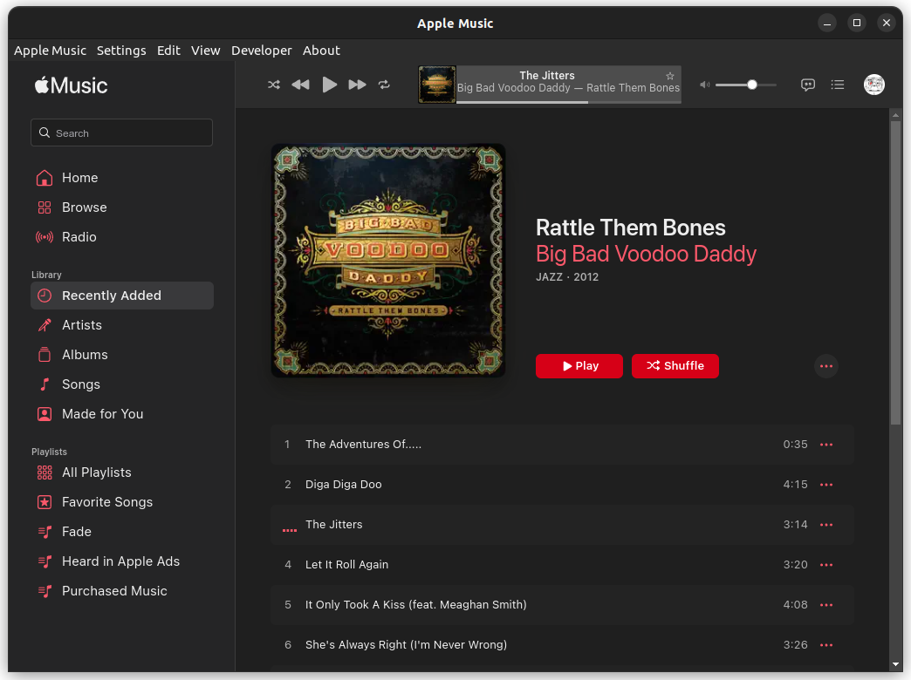

# Apple Music Desktop &nbsp;

An [Electron](https://www.electronjs.org/) app that provides a native Apple Music experience for Linux & Windows

It has an "About" Window that lists the App Version, [Electron](https://www.electronjs.org/), [Chromium](https://www.chromium.org/), [Node](https://nodejs.org/), and [V8](https://v8.dev/) versions for the given Electron version in the package.json.

It has many menu items, adding on top of the default ones, and a tray icon which you can use to focus the app or minimize it to the tray.

## Screenshot


## Installation

See the [Releases](https://github.com/Alex313031/apple-music-desktop/releases).

## Building

Requires nodejs 16, or 18. It is reccomended to use [nvm](https://github.com/nvm-sh/nvm) for installing/managing node versions.
Yarn can also be used.

```bash
git clone https://github.com/Alex313031/apple-music-desktop.git
cd apple-music-desktop
nvm install # Only use if you are using nvm
npm install # Install needed npm deps
npm run start # Run app in dev mode
```

## TODO

See [TODO.txt](TODO.txt)
